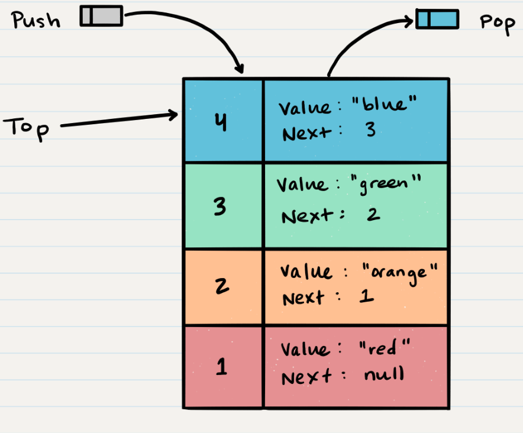

# Class 10

## Stacks and Queues
-(https://codefellows.github.io/common_curriculum/data_structures_and_algorithms/Code_401/class-10/resources/stacks_and_queues.html)

### Terminology
1. Push - Nodes or items that are put into the stack are pushed
2. Pop - Nodes or items that are removed from the stack are popped. When you attempt to pop an empty stack an exception will be raised.
3. Top - This is the top of the stack.
4. Peek - When you peek you will view the value of the top Node in the stack. When you attempt to peek an empty stack an exception will be raised.
5. IsEmpty - returns true when stack is empty otherwise returns false.

- FILO - First In Last Out
- LIFO - Last In First Out

#### Stack Visualization

- The topmost item is denoted as the "top".
- pushing something to the stack it becomes the top value. Popping something from the stack you pop the current top. and set the next tip as top.next.

#### Push O(1)
- "Pushing a Node onto a stack will always be an O(1) operation. This is because it takes the same amount of time no matter how many Nodes (n) you have in the stack."
- "When adding a Node, you push it into the stack by assigning it as the new top, with its next property equal to the original top."
