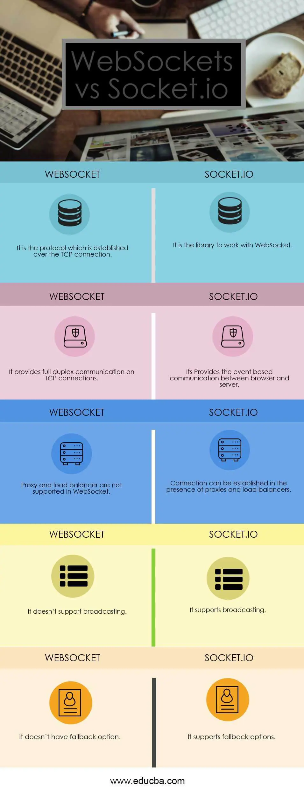

# Class 12

## Socket.io

### Web Sockets
- Web-Socket (https://en.wikipedia.org/wiki/WebSocket)
1. What is a Web Socket?

- "is a computer communications protocol, providing full-duplex communication channels over a single TCP connection."

2. Describe the Web Socket request/response handshake and what happens once the connection is established.

- The client sends a WS request which the server returns a WS response. Client request (just like in HTTP, each line ends with \r\n and there must be an extra blank line at the end):. this allows servers to handle HTTP and WS connections to be on the same port. Once connection is established, communication swithces to a bidirectional binary protocol which does not conform to the HTTP protocol. 

3. Web Sockets provide a standardized way for the server to send content to a client without first receiving a ____ from that client.
- Request

### Socket.io Tutorial
1. What does the event handler io.on() do?
- io.on is like addListener it listens for an event

2. Describe some possible proof of life or proof that the code works as expected

var http = require('http').Server(app);
var io = require('socket.io')(http);

app.get('/', function(req, res){
   res.sendFile('E:/test/index.html');
});

io.on('connection', function(socket){
   console.log('A user connected');
setTimeout(function(){
      socket.send('Sent a message 4seconds after connection!');
   }, 4000);
   socket.on('disconnect', function () {
      console.log('A user disconnected');
   });
});
http.listen(3000, function(){
   console.log('listening on *:3000');
});
- we need to handle this event on our client side, to do so, replace the contents of the index.html page with the following 

< !DOCTYPE html > -->

< html >

   < head>< title>Hello world</ title>< /head>
   < script src="/socket.io/socket.io.js">< /script>
   < script>

      var socket = io();
      socket.on('message', function(data){document.write(data)});

   < /script>

   < body>Hello world< /body>

< /html>

3. What does socket.emit() do?

- it sends a message to all the connected clients. This code will notify when a user connects to the server. socket, its takes in a sting has is the name of your event and then it finds it and emits that event you have set up

### Socket.io vs Web Sockets
1. What is the difference between WebSocket and Socket.IO? (think Git and GitHub, or OAuth and Auth0).

- It provides the Connection over TCP, while Socket.io is a library to abstract the WebSocket connections.
- WebSocket doesn’t have fallback options, while Socket.io supports fallback.
- WebSocket is the technology, while Socket.io is a library for WebSockets.

2. When would you use Socket.IO?
- to build real time applications like multiplayer games, and chat rooms. - Stack OverFlow
3. When would you use WebSockets?

- When a client needs to react quickly to a change (especially one it cannot predict), a WebSocket may be best

- Resources:
  - OSI Model Explained 
    - <https://www.youtube.com/watch?v=vv4y_uOneC0>
  - TCP Handshakes Explained
    - <https://www.youtube.com/watch?v=xMtP5ZB3wSk>
  - Socket.io Documentation 
    - <https://socket.io/docs/>
  - Socket.io Server API
    - <https://socket.io/docs/server-api>
  - Socket.io Client API 
    - <https://socket.io/docs/client-api>
  - Socket Testing Tool
    - <https://amritb.github.io/socketio-client-tool/>
