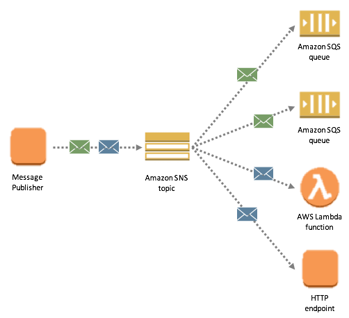
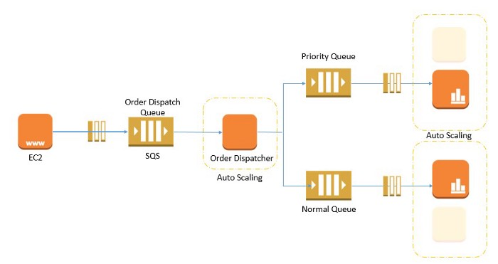

# Class 19

### AWS: Events

#### AWS SQS vs SNS

1. What is the difference betweeen SQS and SNS?
  - SQS is a Simple Queue Service and SNS is a Simple Notification Service
    - SNS is a distributed *publish-subscribe* service and SQS is distributed *queuing* service.
- SNS

- SQS

- SNS will just notify when theres an notification
- SQS will keep things in order 
2. What are some use cases for both SNS and SQS?
- Choose SNS if:
  - You would like to be able to publish and consume batches of messages.
  - You would like to allow same message to be processed in multiple ways.
  - Multiple subscribers are needed.

- Choose SQS if:
  -  You need a simple queue with no particular additional requirements.
  - Decoupling two applications and allowing parallel asynchronous processing.
  - Only one subscriber is needed.

### AWS SNS and SQS

1. Describe how to use SQS and SNS in a “fanout” pattern.
  - 
2. Explain how “push notifications” work, using SNS.
  - 

### SQS and SNS Basics

1. How might a large scale, distributed application make use of a Queue system like SQS?
  - 

Resources:

- <https://medium.com/awesome-cloud/aws-difference-between-sqs-and-sns-61a397bf76c5>
- <https://www.youtube.com/watch?v=mXk0MNjlO7A>
- <https://www.youtube.com/watch?v=UesxWuZMZqI>

- <https://docs.aws.amazon.com/AWSJavaScriptSDK/latest/AWS/SNS.html>
- <https://docs.aws.amazon.com/AWSJavaScriptSDK/latest/AWS/SQS.html>
