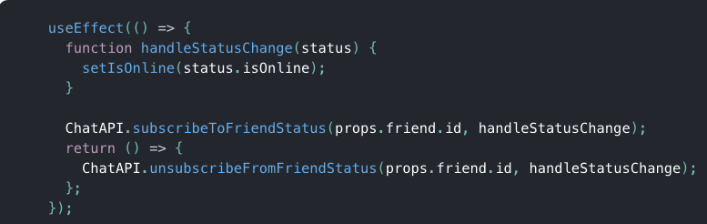

# Class 28

## Component Lifecycle / useEffect Hook

### Effects Hook

1. What purpose does useEffect serve in a function component compared to its counterpart(s) in class components?

- it does the same as if you were using componentDidMount, componentDidUpdate and componentWillUnmount all combined.

2. When using the useEffect Hook:

   1. What does useEffect do?

      - it lets React know that your component needs to do something after rendering.

   2. Why is useEffect called inside a component?

      - Placing useEffect inside the component lets us access the count state variable (or any props) right from the effect.

3. Explain the importance of properly implementing effects with Cleanup

- the importance of Cleanup is so that we don’t introduce a memory leak!

### Extra Notes

Tip

- If you’re familiar with React class lifecycle methods, you can think of useEffect Hook as componentDidMount, componentDidUpdate, and componentWillUnmount combined.
- useEffect By default, it runs both after the first render and after every update. Instead of thinking in terms of “mounting” and “updating”, you might find it easier to think that effects happen “after render”. React guarantees the DOM has been updated by the time it runs the effects.
- Every time we re-render, we schedule a different effect, replacing the previous one.
- We’ve learned that useEffect lets us express different kinds of side effects after a component renders. Some effects might require cleanup so they return a function:
  - useEffect
    
- Other effects might not have a cleanup phase, and don’t return anything.

  - useEffect(() => {
    document.title = `You clicked ${count} times`;
    });
    - The Effect Hook unifies both use cases with a single API.
