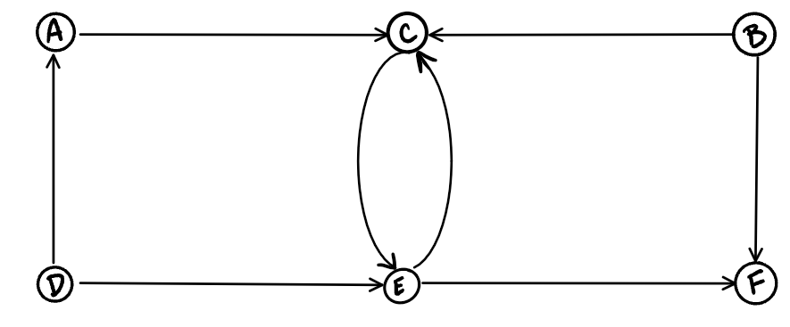
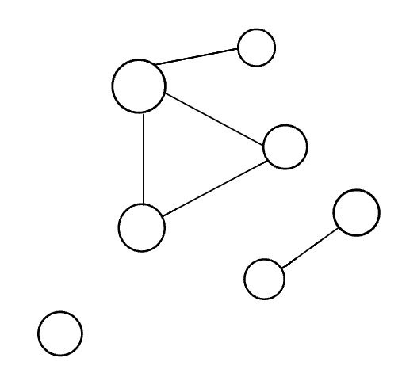

# Class 35

## Graphs

1. A graph is a non-linear data structure that can be looked at as a collection of vertices (or nodes) potentially connected by line segments named edges.

- Common terminology used when working with Graphs:

  - Vertex - A vertex, also called a “node”, is a data object that can have zero or more adjacent vertices.
  - Edge - An edge is a connection between two nodes.
  - Neighbor - The neighbors of a node are its adjacent nodes, i.e., are connected via an edge.
  - Degree - The degree of a vertex is the number of edges connected to that vertex.

## Directed vs Undirected

### Undirected Graphs

1. An Undirected Graph is a graph where each edge is undirected or bi-directional. This means that the undirected graph does not move in any direction.

2. For example, in the graph below, Node C is connected to Node A, Node E and Node B. There are no “directions” given to point to specific vertices. The connection is bi-directional.

Undirected Graph

- this undirected graph has 6 vertices and 7 undirected edges.
- vertices/nodes = {a,b,c,d,e,f}
  Edges = {(a,c),(a,d),(b,c),(b,f),(c,e),(d,e),(e,f)}

Directed Graphs (Digraph)
A Directed Graph also called a Digraph is a graph where every edge is directed.

Unlike an undirected graph, a Digraph has direction. Each node is directed at another node with a specific requirement of what node should be referenced next.

Compare the visual below with the undirected graph above. Can you see the difference? The Digraph has arrows pointing to specific nodes.

- The directed graph above has six vertices and eight directed edges

- Vertices = {a,b,c,d,e,f}

- Edges = {(a,c),(b,c),(b,f),(c,e),(d,a),(d,e)(e,c)(e,f)}

## Complete vs Connected vs Disconnected

- There are many different types of graphs. This depends on how connected the graphs are to other node/vertices.

- The three different types are completed, connected, and disconnected.

### Complete Graphs

- A complete graph is when all nodes are connected to all other nodes.
  

## Connected

A connected graph is graph that has all of vertices/nodes have at least one edge.
.png>)
In the visual above, this looks a lot more than what you are used to seeing. If you look closely at the different vertices of the graph, you will see that each node is connected to at least one other node or vertices. A Tree is a form of a connected graph. We will talk more about that in a bit.

## Disconnected

A disconnected graph is a graph where some vertices may not have edges.

In the above visual, the disconnected graph shows that some nodes may not always be connected to other nodes or vertices of the graph. It is complelty possible to have standalone nodes or edges (also known as islands) in a graph data structure.

## Acyclic vs Cyclic

In addition to undirected and directed graphs, we also have acyclic and cyclic graphs.

## Acyclic Graph

An acyclic graph is a directed graph without cycles.

A cycle is when a node can be traversed through and potentially end up back at itself.

Here is an example of 3 acyclic graphs:

A directed acyclic graph is also called a DAG. This can also be represented as what we know as a tree.

## Cyclic Graphs

A Cyclic graph is a graph that has cycles.

A cycle is defined as a path of a positive length that starts and ends at the same vertex.

Here is an example of a two different cyclic graph:

## Weighted Graphs

A weighted graph is a graph with numbers assigned to its edges. These numbers are called weights. This is what a weighted graph looks like:

When representing a weighted graph in a matrix, you set the element in the 2D array to represent the actual weight between the two paths. If there is not a connection between the two vertices, you can put a 0, although it is known for some people to put the infinity sign instead.

## Traversals

### Breadth First

In a breadth first traversal, you are starting at a specific vertex/node. This node must be specified when calling the BreadthFirst() method.
Breadth first traversal is when you visit all the nodes that are closest to the root as possible. From there you traverse outwards, level by level, until you have visited all the vertices/nodes.

- Traversing a graph that has cycles will result in an infinite loop….this is bad.
- To prevent such behavior, we need to have some way to keep track of whether a vertex has been “visited” before. Upon each visit, we’ll add the previously-unvisited vertex to a visited set, so we know not to visit it again as traversal continues.

Here is what the algorithm breadth first traversal looks like:

1. Enqueue the declared start node into the Queue.
2. Create a loop that will run while the node still has nodes present.
3. Dequeue the first node from the queue
4. if the Dequeue‘d node has unvisited child nodes, add the unvisited children to visited set and insert them into the queue.
   visual for a breadth first:
   

- Algorithm
  

1. We have declared that our starting node (or root) is going to be Node A.
2. The first thing we want to do is Enqueue the root.
3. We also need to add the root to the visited set.
4. Next, we enter a while loop. We want this loop to keep running until there are no more nodes in our queue.
5. Once we are in the while loop, we want to Dequeue the front node and then check to see if it has any children.
6. if there are children of the node we are currently looking at, we want to add them to visited set. This will help us know that we have already seen that node before, and won’t accidently push us into an infinite loop if the graph was cyclic. In addition to tracking each child node as visited, we want to place any of its children that have not yet been visited into the queue.
7. The process will complete until the queue is empty.
8. Once the while loop breaks, we can then return the list of nodes. This list will contain, in order, all the nodes that were traversed.

### Resources

- Graphs
  - <https://codefellows.github.io/common_curriculum/data_structures_and_algorithms/Code_401/class-35/resources/graphs.html>
